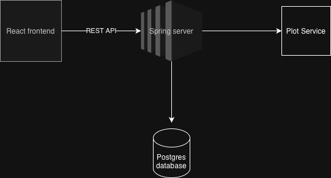
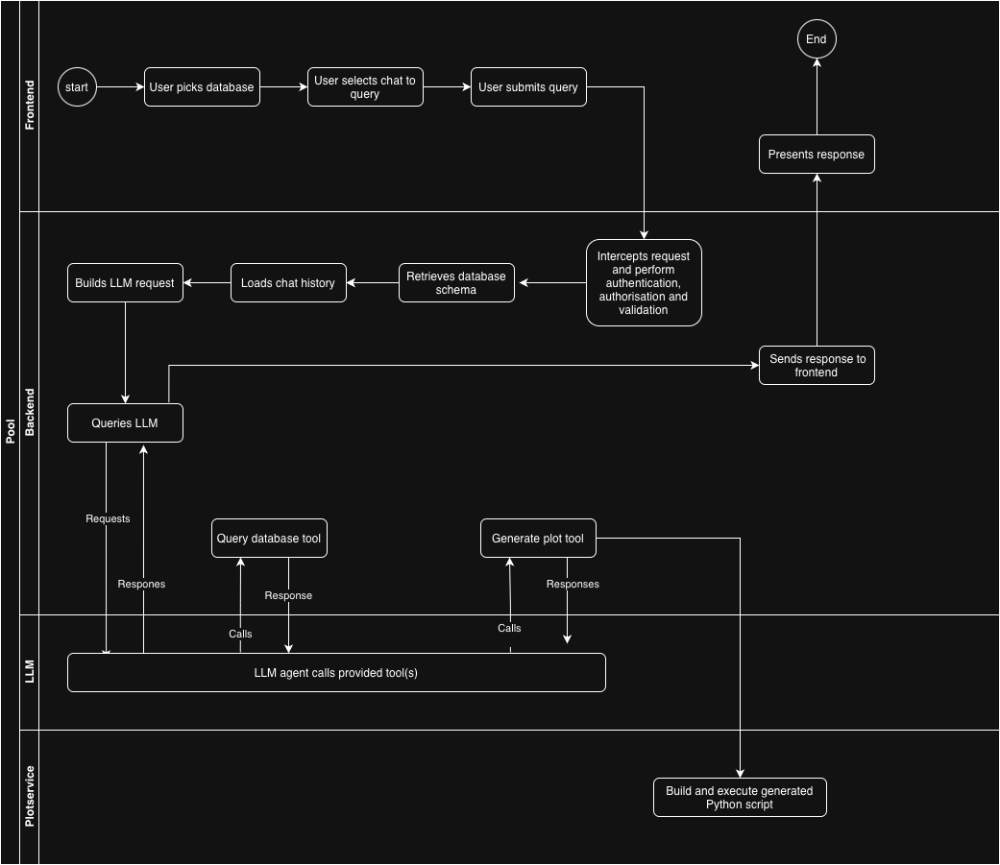

# NoQL - No Query Language


[](https://www.java.com/en/)
[](https://spring.io)
[](https://junit.org/junit5/)
[](https://gradle.org)
[](https://www.postgresql.org)
[](https://www.typescriptlang.org)
[](https://react.dev)
[](https://www.docker.com)


---

## 🚀 Project Overview

**NoQL (No Query Language)** is an **AI-powered, full-stack data analysis platform** that enables users to **query databases using natural language** and **visualize results instantly**.

**Key Highlights:**

- **Natural Language Queries:** Ask questions in plain English and get answers from your database
- **Interactive Visualizations:** Generate tables and charts via a dedicated plot service
- **Secure LLM Integration:** Backend integrates with **OpenAI GPT** and **Anthropic Claude** for intelligent query handling
- **Modern Full-Stack Architecture:**
    - **Backend:** Java + Spring Boot, PostgreSQL
    - **Frontend:** React + TypeScript SPA
    - **Plot Service:** Dockerized Python service for visualization
- **Production-Ready DevOps:** Dockerized services, CI/CD pipelines, AWS deployment

---

## 🗂️ Table of Contents

- [Description](#-description)
- [Tech Stack](#-tech-stack)
- [Software Requirements](#-software-requirements)
- [Architecture](#-architecture)
- [Project Structure](#-project-structure)
- [How to Run](#-how-to-run)
- [Pipelines (CI/CD)](#-pipelines-cicd)
    - [Environment Variables and Secrets](#-environment-variables-and-secrets)
    - [CI Pipelines](#-ci-pipelines)
    - [Deployment Pipeline](#-deployment-pipeline)
    - [Tear-down Pipeline](#-tear-down-pipeline)

---

## 📝 Description

More details about backend and fronend components are describe in:

- [Backend README](backend/README.md)
- [Frontend README](frontend/NoQL/README.md)

---

## 🔨 Tech Stack

### Backend

- [Java 17](https://www.java.com/en/)
- [Spring](https://spring.io)
- [Gradle](https://gradle.org)
- [PostgreSQL](https://www.postgresql.org)
- [MySQL](https://www.mysql.com)
- [Docker](https://www.docker.com)
- [Docker Compose](https://docs.docker.com/compose/)
- [Swagger](https://swagger.io)
- [Python](https://www.python.org)
- [Matplotlib](https://matplotlib.org)
- [GPT API](https://openai.com/api/)
- [Anthropic API](https://www.anthropic.com/learn/build-with-claude)

### Frontend

- [React](https://react.dev)
- [TypeScript](https://www.typescriptlang.org)
- [Vite](https://vite.dev)
- [Material UI](https://mui.com)
- [Nginx](https://nginx.org)

### Infrastructure & Others

- [AWS](https://aws.amazon.com/console/)
- [CloudFormation](https://docs.aws.amazon.com/AWSCloudFormation/latest/UserGuide/Welcome.html)
- [Make](https://cs.wikipedia.org/wiki/Make)
- [Git](https://git-scm.com)
- [GitHub Actions](https://github.com/features/actions)
- [Bash](https://cs.wikipedia.org/wiki/Bash)

---

## ✅ Software Requirements

**Backend**

- [Java 17](https://www.java.com/en/)
- [Gradle](https://gradle.org) (or use the included Gradle Wrapper)
- [Docker](https://www.docker.com)
- [Docker Compose](https://docs.docker.com/compose/)

**Frontend**

- [Node.js 18+](https://nodejs.org/en/blog/announcements/v18-release-announce)
- [Docker](https://www.docker.com)
- [Docker Compose](https://docs.docker.com/compose/)

**Deployment**

- [AWS CLI](https://aws.amazon.com/cli/)
- [Make](https://cs.wikipedia.org/wiki/Make)
- [Bash](https://cs.wikipedia.org/wiki/Bash)

---

## 🏛 Architecture

The system is composed of **five main components**:

- **Backend** – business logic and REST API
- **Frontend** – user interaction SPA
- **Plot Service** – isolated Python service for plots
- **PostgreSQL** – data persistence
- **LLM(s)** – external AI agents for natural language processing

**Components:**



**Request flow diagrams:**



---

## 🌲 Project Structure

```text
.github/
├─ workflows/                             # GitHub workflows (pipelines)
backend/                                  # backend root
ci/
├─ scripts                                # scripts used in pipelines
customModel/                              # [Deprecated ]custom LLM api (separate project - gpt proxy)
frontend/                                 # frontend app root
infra/                                    # infrastructure
├─ local-stack/                           # docker compose stacks, files, ...
|  ├─ scripts                             # scripts
|  ├─ stack-date                          # persists data from docker containers
├─ prod-stack/                            # AWS stack
|  ├─ infra.yaml                          # AWS infrastructure cloud formation
|  ├─ Makefile                            # deployment tasks
|  ├─ README.md                           # deployment documentation
├─ scripts/                               # infra related scripts
README.md                                 # Documentation
```

---

## 🏃 How to Run

The application can be run in several ways, depending on your needs:

- **Deploy to AWS (production-like)**
    - Using GitHub Actions: see the **Deployment Pipeline** section
    - Manual deployment: [`infra/prod-stack/README.md`](infra/prod-stack/README.md)

- **Run locally with Docker Compose**
    - Instructions: [`infra/local-stack/README.md`](infra/local-stack/README.md)

- **Run components natively (development)**
    - Backend: [`backend/README.md`](backend/README.md#-how-to-run)
    - Frontend: [`frontend/NoQL/README.md`](frontend/NoQL/README.md#-how-to-run)

---

## 🔁 Pipelines (CI/CD)

The project uses a multi-pipeline CI/CD setup consisting of:

- **Component-specific CI pipelines** for the backend, frontend, and plot service
- A **deployment pipeline** that provisions infrastructure and deploys all components
- A **tear-down pipeline** that removes the AWS infrastructure

### 🔐 Environment Variables and Secrets

The following **secrets and variables** must be configured in **GitHub** for the CI/CD pipelines.

#### Secrets

| Name                    | Description                                                                                                                      |
|-------------------------|----------------------------------------------------------------------------------------------------------------------------------|
| `AWS_ACCESS_KEY_ID`     | AWS access key ID used by deployment and tear-down pipelines                                                                     |
| `AWS_SECRET_ACCESS_KEY` | AWS secret access key used by deployment and tear-down pipelines                                                                 |
| `AWS_SSH_KEY_VALUE`     | Private SSH key used to access the AWS EC2 instance                                                                              |
| `BACKEND_DOT_ENV`       | Backend `.env` file content for the production stack, variables description: [backend/README.md](backend/README.md)              |
| `FRONTEND_DOT_ENV`      | Frontend `.env` file content for the production stack, variables description: [frontend/NoQL/README.md](frontend/NoQL/README.md) |
| `DOCKERHUB_USERNAME`    | Docker Hub username                                                                                                              |
| `DOCKERHUB_TOKEN`       | Docker Hub access token                                                                                                          |
| `GH_ACCESS_TOKEN`       | GitHub access token with read & write repository access                                                                          |

#### Variables

| Name               | Description                                                                                          |
|--------------------|------------------------------------------------------------------------------------------------------|
| `AWS_SSH_KEY_NAME` | Name of the EC2 SSH key pair how to get it: [infra/prod-stack/README.md](infra/prod-stack/README.md) |
| `NOQL_AWS_REGION`  | AWS region where the infrastructure is deployed                                                      |

---

### 📦 CI Pipelines

CI pipelines are triggered automatically on **pull requests targeting the `main` branch** and can
also be **run manually**.

Each component (backend, frontend, and plot service) has its **own dedicated CI pipeline**, allowing
independent validation, testing, and builds.

<details>
<summary><b>Backend CI Pipeline</b></summary>

#### [Backend CI Pipeline](.github/workflows/backend.yaml)

▶️ [GitHub trigger](https://github.com/janbabak/NoQL/actions/workflows/backend.yaml)

##### Jobs

- **Validate**
    - Detects changes in the [`backend`](backend) directory.
    - If changes are detected:
        - Verifies that the backend version has been incremented.
        - Runs backend linting checks.

- **Test**
    - Runs when:
        - Backend changes were detected in the **Validate** job, or
        - A pull request has been merged, or
        - The workflow is manually triggered.
    - Executes **unit and integration tests** with coverage reporting.
    - Coverage results are published in the **job summary**.
    - When triggered by a **PR merge**, updates `backend_coverage.json` in the
      `coverage-badge` branch.  
      This file is used to generate the **coverage badge** displayed at the top of this file.

- **Build**
    - Builds the backend JAR artifact.
    - If the workflow is manually triggered with `push_docker=true`:
        - Builds and pushes the Docker image `janbabak/noql-backend`
          to [Docker Hub](https://hub.docker.com/r/janbabak/noql-backend).
        - The Docker image tag matches the backend version.

</details>

<details>
<summary><b>Plot Service CI Pipeline</b></summary>

#### [Plot Service CI Pipeline](.github/workflows/plotservice.yaml)

▶️ [GitHub trigger](https://github.com/janbabak/NoQL/actions/workflows/plotservice.yaml)

##### Jobs

- **Validate**
    - Detects changes in [`plotService.Dockerfile`](backend/docker/plotService.Dockerfile).
    - If changes are detected:
        - Verifies that the plot service version has been incremented.

- **Build**
    - Runs only when the workflow is manually triggered with `push_docker=true`.
    - Builds and pushes the Docker image `janbabak/noql-plot-service`
      to [Docker Hub](https://hub.docker.com/r/janbabak/noql-plot-service).
    - The Docker image tag matches the plot service version.

</details>

<details>
<summary><b>Frontend CI Pipeline</b></summary>

#### [Frontend CI Pipeline](.github/workflows/frontend.yaml)

▶️ [GitHub trigger](https://github.com/janbabak/NoQL/actions/workflows/frontend.yaml)

##### Jobs

- **Validate**
    - Detects changes in the [`frontend`](frontend) directory.
    - If changes are detected:
        - Verifies that the frontend version has been incremented.

- **Build**
    - Builds and packages the frontend application.
    - If the workflow is manually triggered with `push_docker=true`:
        - Builds and pushes the Docker image `janbabak/noql-frontend`
          to [Docker Hub](https://hub.docker.com/r/janbabak/noql-frontend).
        - The Docker image tag matches the frontend version.

</details>

---

### ,🚀 Deployment Pipeline

#### [Deployment Pipeline](.github/workflows/stack-deploy.yaml)

▶️ [GitHub trigger](https://github.com/janbabak/NoQL/actions/workflows/stack-deploy.yaml)

The deployment pipeline deploys **all system components** (backend, frontend, and plot service)
to AWS.

- The pipeline can be triggered **only manually**.
- It accepts a single input parameter: **stack ID**.

#### Jobs

- **Deploy Infrastructure**
    - Authenticates with AWS.
    - Deploys infrastructure defined in the CloudFormation template:
        - [`infra.yaml`](infra/prod-stack/infra.yaml)

- **Deploy Application (Docker Compose)**
    - Loads environment variables from:
        - [`.env.backend-prod`](infra/local-stack/.env.backend-prod) (Needs to be created)
        - [`.env.frontend-prod`](infra/local-stack/.env.frontend-prod) (Needs to be created)
    - Starts Docker Compose, pulling Docker images from Docker Hub.
    - The frontend URL is printed in the output of the **Print stack URL** step.

---

### 🧹 Tear-down Pipeline

#### [Tear-down Pipeline](.github/workflows/stack-tear-down.yaml)

▶️ [GitHub trigger](https://github.com/janbabak/NoQL/actions/workflows/stack-tear-down.yaml)

The tear-down pipeline removes the AWS infrastructure.

- The pipeline can be triggered **only manually**.
- It accepts a single input parameter: **stack ID**.

#### Jobs

- **Tear Down Infrastructure**
    - Authenticates with AWS.
    - Deletes infrastructure defined in the CloudFormation template:
        - [`infra.yaml`](infra/prod-stack/infra.yaml)
  